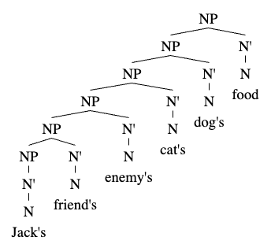

Possessors go in the **specifier**. In Syntax 330, treat this as a dogmatic rule.* Before you learn about the **DP-structure/DP-hypothesis**, you will put possessors in the spec of NP; after you learn DP-structure, you will put possessors in the spec of DP.  
  
In the image below, compare the DP "The" with the DPs "Their" and "Bob's": 

To list multiple possessors, the NP-structure is on the left while the DP-structure is on the right. Note that in the DP-structure, even though "Jack" is a proper noun, the possessor "Jack's" is a determiner.

*There is a reason why it's done, and it's because of semantics. Possessors require a person or thing that possesses. The phrase "Bill's cat" implies not only that there is a cat, but that there is a Bill who possesses a cat. Similarly "That cat" has one DP&#151the cat&#151while "Their cat" has two DPs&#151they and the cat.
