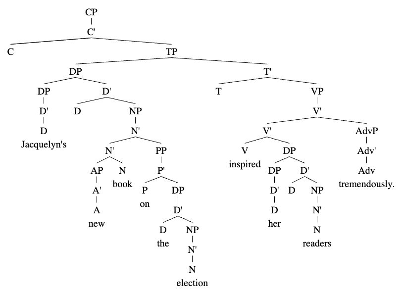

# Sample Tree For Introducing X'-Theory

- `[S[NP[NP[N'[N Jacquelyn's]]][N'[N'[AP[A'[A new]]][N'[N book]]][PP[P'[P on][NP[DP[D'[D the]]][N'[N election]]]]]]][VP[V'[V'[V inspired][NP[DP[D'[D her]]][N'[N readers]]]][AdvP[Adv'[Adv tremendously.]]]]]` on mshang.ca/syntree/ 

- Because "Jacquelyn's" is a possessor/anaphor, it is in the **specifier** position of “new book on the election.” 

- Compare "her readers" with "tremendously" in the VP: "her readers" is a **complement** while "tremendously" is an **adjunct**. By the tree, this is because the NP "her readers" is the sister node to the head V while the AdvP "tremendously" is the sister node to V'. Intuitively, adjuncts add additional, usually optional details to modify a head while complements provide more intrinsic information. 

- By the end of the course, the tree should look as it does below:

