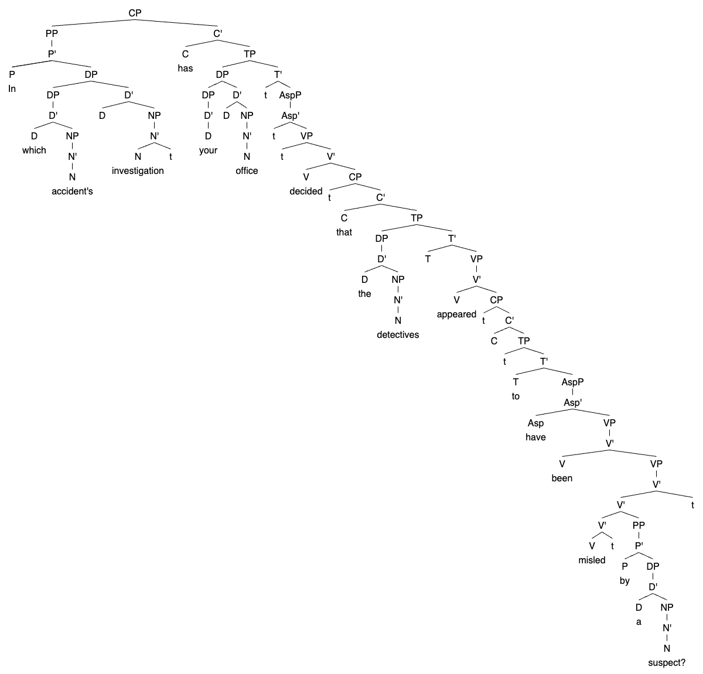

My professor posted a syntax tree and said, "It includes every type of trace in nearly all contexts introduced throughout the semester. It might be a small exercise to use your own ways to mark out which trace is for which moved constituent. Color-coding, indexing, whatever." I will not give my answers, but I will give some leading questions below as hints.

* There is a trace next to "investigation." **It is an investigation of what?**
* **Test**

`[CP[PP[P'[P In][DP[DP[D'[D which][NP[N'[N accident's]]]]][D'[D][NP[N'[N investigation][t]]]]]]][C'[C has][TP[DP[DP[D'[D your]]][D'[D][NP[N'[N office]]]]][T'[t][AspP[Asp'[t][VP[t][V'[V decided][CP[t][C'[C that][TP[DP[D'[D the][NP[N'[N detectives]]]]][T'[T][VP[V'[V appeared][CP[t][C'[C][TP[t][T'[T to][AspP[Asp'[Asp have][VP[V'[V been][VP[V'[V'[V'[V misled][t]][PP[P'[P by][DP[D'[D a][NP[N'[N suspect?]]]]]]]][t]]]]]]]]]]]]]]]]]]]]]]]]]`
