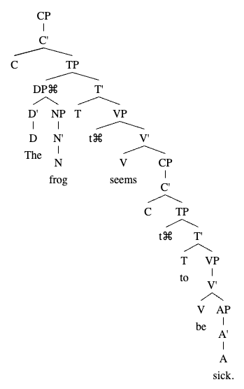

At the very end of Syntax 330, we discussed putting a trace in the specifier of VP next to the subject. Why? The motivating reason is that for languages with different word orders—English is a `Subject-Verb-Object` language, but other languages have `Verb-Subject-Object` for instance—and this allows for sentences to have subjects at the beginning of sentences regardless. The intuitive reason is that when one considers a sentence like, "He eats ice cream," the VP "eats ice cream" refers to a subject that eats ice cream ... which is not present in the VP. The trace in the Spec of VP solves this problem. This is how TP is handled anyway.

As a note, the final VP in the tree below does not have a trace in its Spec. Don't worry about it too much, just focus on the VP's which are the most proximate to the subject DP.

