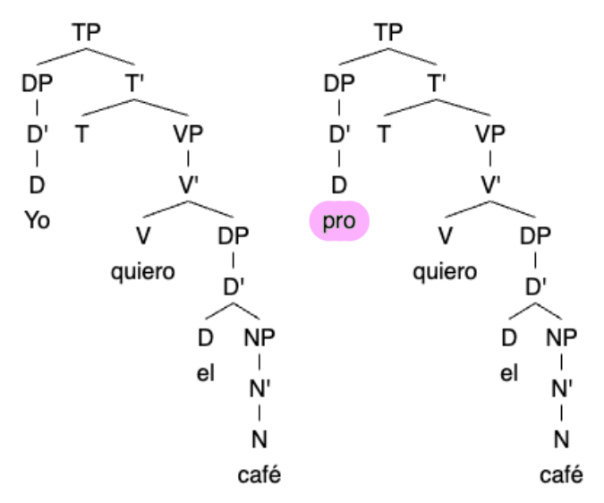

Uppercase "PRO" and lowercase "pro" both serve the same syntactic role: representing a phonologically empty pronoun. Lowercase "pro" is used to represent the phonologically empty pronoun that serves as the subject of a <ins>finite</ins> clause, dropped for convenience or because there's no word for it. <ins>English does not have pro!</ins> In English, all finite clauses have some explicit phrase to go in the subject. Spanish does use pro because Spanish is pro-drop, meaning that subject pronouns may be included but often are not:
* Yo quiero el café. → Quiero el café.
* Nosotros vamos. → Vamos.
{ width: 20px; }

English does use PRO. PRO is the phonologically empty pronoun that serves as the subject of an <ins>infinite</ins> clause.
